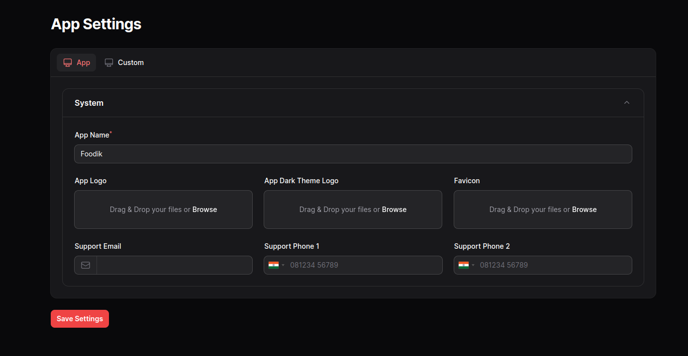

# Filament App Settings

This package will help you to build settings pannel with custom forms, which supports all Filament forms components.
## Installation

Install Using Composer

```
composer require cwsps154/filament-app-settings

```
Run

```
php artisan filament-app-settings:install
```

## Usage/Examples

Add this into your Filament `PannelProvider` class `panel()`
```
$panel->plugins([FilamentAppSettingsPlugin::make()]);
```

You will get some customization on this
```
FilamentAppSettingsPlugin::make()->canAccess(function () {
                        return true;
                    })->appAdditionalField([])

```
Here using `canAccess()` method you can prevent the view and edit access to the page and using `appAdditionalField()` method you can add additional sections to the default app tab which will available after you install this plugin.

You can publish the config file `filament-app-settings.php`, by running this command

```
php artisan vendor:publish --tag=filament-app-settings-config
```

which contains these settings

```
return [
    'layout' => null,
    'cluster' => null,
    'navigation' => [
        'title' => 'filament-app-settings::app-settings.app.settings.title',
        'group' => 'filament-app-settings::app-settings.system',
        'label' => 'filament-app-settings::app-settings.app.settings',
        'icon' => 'heroicon-o-cog-8-tooth',
        'sort' => 100,
    ]
];
```
You can create a custom tab to this settings using `php artisan make:app-settings-tab Custom` command, which will create a class inside `app/Filament/Settings/Forms` folder.

```
<?php

namespace App\Filament\Settings\Forms;

use Filament\Forms\Components\Tabs\Tab;

class Custom
{
    /**
     * @return Tab
     */
    public static function getTab(): Tab
    {
        return Tab::make('custom')
                    ->label(__('Custom'))
                    ->icon('heroicon-o-computer-desktop')
                    ->schema(self::getFields())
                    ->columns()
                    ->statePath('custom');
    }

    public static function getFields(): array
    {
        return [];
    }
}
```

You can customize the tab sections using the `getTab()`. Please note that you should give a unique name to the tab, statePath. Because, we are using custom helper function `get_settings()` to fetch the settings data. So the these names should be unique.

`get_settings()` accept the 'tab_name.field_name'.

Example : `get_settings('app.app_logo'))`. This will support nested fields like `Repeater`, these values you can access by dot.

`getFields()` returns the array of Filament forms component. You can use all available forms component here.
## Screenshots




## Thanks

Actually this package I was build after using one already existing Filament plugin which is called Filament General Settings. I found some limitations to that packages, So I created this one.
Thanks
